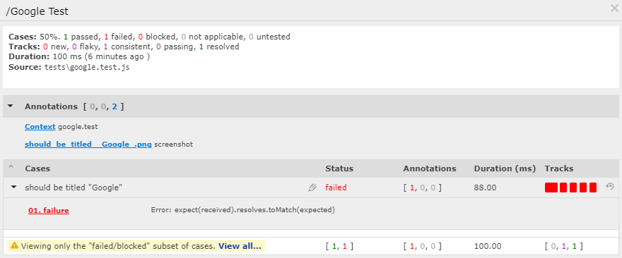

# my.jest-puppeteer
A *Sandbox repo* to show how Jest, Puppeteer, and Testspace can work together. The repo demonstrates how to capture `screenshots` of failing tests and attach them to the associated `suite` when publishing test results to Testspace.


There are two use cases supported:
  1. capture a screenshot of a test failure
  2. and capture an image difference when a visual test fails using the [jest image snapshot](https://github.com/americanexpress/jest-image-snapshot) package

To support attaching screenshots/images, a Testspace [content list file](https://help.testspace.com/publish/push-data-results#content-list) is used. When a test fails, an image is created (or used if auto-generated) and an entry is added to the content list file. The image name is based on the test case name.

An example content list file entry (`screenshots-list.txt`):

```
"[Suite Name]+./screenshots/test case name.jpeg{screenshot}"
```

When publishing the following command line is used:
```
testspace junit.xml @./screenshots-list.txt
```

Note, publishing always include the context list, even when empty.

## Example
The following is an example of the **test results** published to [Testspace](https://munderseth.testspace.com/spaces/195953/current):
<br>


When selecting the `Google Test` suite refer to the **Annotations** listing `should be tilted Google.jpeg` :

<br>




## Customization
The following 3 packages are required:
- [Jest Puppeteer](https://github.com/smooth-code/jest-puppeteer) - Tests using Jest & Puppeteer
- [Jest Image Snapshot](https://github.com/americanexpress/jest-image-snapshot) - used for Visual Regression Testing
- [Jest Junit](https://www.npmjs.com/package/jest-junit) - Use for Publishing results to Testspace

To enable the attachment of images automatically on test failures, the [PuppeteerEnvironment](
https://github.com/smooth-code/jest-puppeteer#extend-puppeteerenvironment) is required to be extended.
- Determine the test case name. Refer to this [Issue](https://github.com/facebook/jest/issues/7774) for more details.
- Create the screenshot associated with the test failure
- Or find the screenshot different on failure

Refer to `jest-custom-environment.js` for specifics. Refer to `jest-custom-global-setup.js` and the global setup requirements.


### Constraints

- Requires defining **testDir** within `jest-custom-environment.js` (defaults to `./tests`)
- Subfolders are **not** supported
- Nested `describes` **not** supported
- Quotes (") with test names **not** supported


The following hardcoded settings:
- the auto-generated `screenshots` folder that contains images
- the auto-generated `screenshots-list.txt`file used for publishing images based on failures

## Usage
To run this example:

```
jest
```
```
sh pushTestspace.sh
```

To run with visable browser
```
 HEADLESS=false jest ...
 ```

### Image Snapshot

Image Snapshot requires expanding "Expects" within the file:
```
const { toMatchImageSnapshot } = require('jest-image-snapshot');
expect.extend({ toMatchImageSnapshot });
```

## Setup
The following steps are required to setup from scratch.

`.gitignore`
```
node_modules
junit.xml
screenshots-list.txt
screenshots
tests/__image_snapshots__/__diff_output__
```
### Packages

Create initial `package.json` file.
```
npm init -y
```

Using package - https://github.com/smooth-code/jest-puppeteer
```
npm install --save-dev jest-puppeteer puppeteer jest
```

Using Jest Image Snapshot - https://github.com/americanexpress/jest-image-snapshot
```
npm i --save-dev jest-image-snapshot
```

Junit output - https://www.npmjs.com/package/jest-junit
```
npm install --save-dev jest-junit
```

**Note** requires configuration
Jest junit output - https://help.testspace.com/publish/tools-support-javascript#jest

`.package.json`:
```
"jest-junit": {
    "suiteNameTemplate": "{filepath}",
    "classNameTemplate": "{classname}",
    "titleTemplate": "{title}"
},
```

